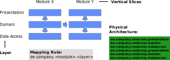

dessert
=======

The name is a short form of **de**pendency a**ssert**. Hence Dessert is a library to check assertions for
dependencies. It is intended to be used within unit-tests.

Features
--------

- Checking dependency rules
- Detection of cyclic dependencies

Goals
-----

- No additional dependencies but plain Java 6 or above
- Simple and intuitive API (motivated by [AssertJ](https://joel-costigliola.github.io/assertj/))
- Assertions should be robust against refactorings (no strings for class or package names required)
- Easy and seamless integration with other testing or assertion frameworks
- Speed

Getting Started
---------------

After having included the test dependency `com.github.hajo70:dessert:0.3` from the
`https://jitpack.io` repository a test checking all dependencies of the dessert library can
be implemented like this:

    @Test
    public void checkDessertDependencies() throws IOException {
        SliceContext sc = new SliceContext();
        Slice dessert = sc.packageTreeOf("de.spricom.dessert")
                .without(sc.packageTreeOf("de.spricom.dessert.test"));
        Slice java = sc.packageTreeOf("java");
        SliceAssertions.assertThat(dessert).usesOnly(java);
    }

### Minimal Maven POM

A copy of the following Maven POM can be used to get started with dessert:

    <?xml version="1.0" encoding="UTF-8"?>
    <project xmlns="http://maven.apache.org/POM/4.0.0"
             xmlns:xsi="http://www.w3.org/2001/XMLSchema-instance"
             xsi:schemaLocation="http://maven.apache.org/POM/4.0.0 http://maven.apache.org/xsd/maven-4.0.0.xsd">
        <modelVersion>4.0.0</modelVersion>
    
        <groupId>com.company.samples</groupId>
        <artifactId>dessert-sample</artifactId>
        <version>1.0-SNAPSHOT</version>
    
        <dependencies>
            <dependency>
                <groupId>com.github.hajo70</groupId>
                <artifactId>dessert</artifactId>
                <version>0.3</version>
                <scope>test</scope>
            </dependency>
            <dependency>
                <groupId>junit</groupId>
                <artifactId>junit</artifactId>
                <version>4.12</version>
                <scope>test</scope>
            </dependency>
        </dependencies>
    
        <repositories>
            <repository>
                <id>jitpack.io</id>
                <url>https://jitpack.io</url>
            </repository>
        </repositories>
    </project>

### Minimal Gradle Buildfile

The corresponding gradle build file looks like this:

    apply plugin: 'java'
    
    repositories {
        jcenter()
        maven { url 'https://jitpack.io' }
    }
    
    dependencies {
        testCompile 'com.github.hajo70:dessert:0.3'
        testCompile 'junit:junit:4.12'
    }

### Samples

There is a separate [dessert-samples](https://github.com/hajo70/dessert-samples) that
shows how to use dessert with features of Java 8.

Using dessert
-------------

- goal of dependency checking is finding unwanted dependencies
- terms: building block, layer, vertical slice
- mapping of building blocks to physical layout
- dependencies to external libraries
- what to check
- operates on .class files
- limitations
- what is a .class file
- what does class X dependends on class Y mean
- elements of dessert API
- problem of cycles
- cycle detection
- MVP-slices
- exploring dependencies

Background
==========

Classes and their dependencies
------------------------------

The goal of dependency checking is finding unwanted dependencies. Dessert does this be analyzing
.class files. The java compiler generates a .class file for each

- class
- interface
- annotation
- (anyonymous) innerclass or inner interface
- enum class

*Note: A java source file can define more than one class.*

Such a .class file X depends on an other .class file Y if X uses Y, thus

- X extends or implements Y
- X has a field of type Y, 
- X uses Y in a method signature (parameter, return value, throws clause)
- X has a local variable of Y
- X uses a (static) method of Y (direct call or method reference)
- X throws Y
- X implements Y within a λ-expression
- X is an inner class of Y (or the other way round)
- X uses generic type of Y
- X is annotated with Y
- X uses Y as an annotation parameter

*Note:*
- Import statements are no relevant, because they don't appear in a .class file.
- It's not possible to detect all of these uses (i. e. local variables, method references)
  by reflection.
- Jdeps does not consider classes used in annotation parameters as a dependency, but dessert does.
- The compiler my have removed some source dependency that cannot be detected in the .class file
  anymore.

Building Blocks
---------------

In a clean software design each class belongs to some building block. Each build block has
defined interfaces and clear dependencies. In complex systems building blocks may be composed
from other building blocks or they may be organized in layers or vertical slices.

Ideally there is a clear and intuitive mapping between the physical package structure and the
building blocks of a software:

Dessert helps you to move towards such a clean software design and alarms you immediately 
if you are moving backward.

Main Elements of the Dessert API
--------------------------------

#### Slice
For dessert your software is just a bunch of classes. Hence you have to cut it down to
pieces that make up building blocks. In dessert such a piece is a called a `Slice`. 
A `Slice` is an arbitrary slice of the set of all classes that belong to a software.
A `Slice` is immutable. The method `slice` can be used to create as smaller `Slice` from
a existing `Slice`. Two slices can be combined with the methods `with` (union) and
`without` (difference) to a new `Slice`.  

#### SliceEntry
Each `SliceEntry` represents a .class file. It has methods like `getClassName()` or
`getClazz()` to access the details of the .class to be used for predicates. It's most
important method is `getUsedClasses()`. This is used by the `SliceAssertions`.

#### SliceContext
The `SliceContext` is the entry point to dessert, a factory for slices. To get your
initial slices you can use the methods `packageOf`, `packageTreeOf` or `sliceOf`. 
The `SliceContext` implements the fly-weight pattern for slice entries. Hence for
two 'SliceEntry' objects x and y that originate from the same `SliceContext`
x.equals(y) is equivalent to x == y. Of nothing else is specified the `SliceContext`
operates on the current class-path.

#### SliceAssertions
`SliceAssertions` is a utility class that provides a fluent API with static methods
analogous to [AssertJ](https://joel-costigliola.github.io/assertj/). It's most important
method is `assertThat` or it's synonym `dessert`, so that it can be used with static
imports without conflicting with AssertJ. The most important methods of the fluent API
are `doesNotUse`, `usesOnly` or the combination of `uses`, `and` and `only()`.

Groups and Cycles
-----------------

The problem with a dependency cycle is: there is no starting point. Thus you cannot use
or test a class involved in a cycle without having all other classes available. (By using
a mocking framework testing of an isolated class is possible with limitations.) Small 
cycles between classes are often necessary, but big interwined cycles make your software
a ball of wool. In such an environment testing is a nightmare, because each simple test
needs a very complex setup that initializes all parts of the software. It is not possible
to re-use such a software without replicating the whole infrastructure with all it's system
requirements, event if only a small part is required.

#### SliceGroup
For cycle detection dessert provides the concept of a `SliceGroup`. A the name says, a
`SliceGroup` is a group of `Slice` objects. The `SliceGroup` has the static convienience
factory methods `splitByPackage` and `splitByEntry` to split up a `Slice` into smaller
corresponding slices. By providing a `SlicePartioner` an arbitrary criterium can be used
to split up a `Slice`. All `SliceEntry` objects the `partKey` methods maps to the same
string will be in the same  `Slice`.

#### Cycle detection
To detect cycles for a `SliceGroup` *sg* you can use:

    SliceGroup<PackageSlice> sg = SliceGroup.splitByPackage(slice);
    SliceAssertions.dessert(sg).isCycleFree();

This can be shortend to:

    SliceAssertions.dessert(slice).splitByPackage().isCycleFree();

#### Enforcing nesting rules
One method to prevent package cycles is establishing dependency rules for nested packages. For
example dessert follows the rule a deeper nested package must not use a class from it's parent
package. `SliceGroup` implements the `Iterator` interface, hence the following code can be used
to enforce this rule:

    Slice slice = new SliceContext().packageTreeOf("de.spricom.dessert");
    SliceGroup<PackageSlice> packages = SliceGroup.splitByPackage(slice);

    packages.forEach(pckg -> SliceAssertions.assertThat(pckg)
            .doesNotUse(pckg.getParentPackage(packages)));

Duplicates
----------

Usage
=====

- 

Old description
---------------

The goal of checking the dependencies of a class is to find any unintended dependency. Hence for each
class there is a set of classes for which dependencies are permitted and an other set of classes
for which dependencies are unwanted or disallowed.

Typically the same dependency rules that apply to one class apply to other somehow related classes.
Thus when specifying dependencies there is a group of related classes for which there may be dependencies
to some other group of classes.

A software product is constructed from different building blocks with defined interfaces within each other.
The classes constituting a building block normally belong to the same package structure, thus they are related.
For example in the dessert library the `de.spricom.dessert.classfile` packages analyze `.class` files, whereas
the `de.spricom.dessert.slicing` package tracks dependencies between related classes. Therefore the `slices`
block uses the `classfile` block, but not the other way round.

A library for dependency checking needs some concept to specify such building blocks. Thus it needs a way
to slice down the bunch of all classes into different parts. In dessert there is the `Slice` interface
to represent one such part or building block.

A `Slice` is an arbitrary set of classes. Therefore we need to
know what a class is: Physically a class is .class file located in some directory tree or a .jar file.
Within a directory tree a class is uniquely defined by its name and its position in the tree structure.
This can be expressed by the fully qualified class name (fqcn), 
i.e. `de.spricom.dessert.classfile.constpool.ConstantPool`. The same applies to a JAR file. But a class
with the same fqcn can appear in different directories or JAR files. Thus we need
besides the fqcn always it's container (directory or JAR file) to specify it
uniquely.

For the following a container is a directory or JAR file that could be added to the CLASSPATH to include
all classes within the container. A class is a concrete .class file uniquely defined by its fqcn name
and its container. Hence for the concepts below an interface or an inner class is a class because
it has its own .class file.

The classes belonging to a `Slice` are represented by `SliceEntry` objects. Each `SliceEntry` corresponds
with a class file inside a container. The same `SliceEntry` object may belong to different `Slice` objects.
The `SliceEntry` provides an API to access all direct dependencies of the corresponding class and other
information (classname, implemenation class, container file) that can be used for predicates.

The starting point for any dependency analysis with Dessert is the `SliceContext`. The `SliceContext` implements
a flyweight pattern for `SliceEntry` objects. Thus for two `SliceEntry` objects `se1` and `se2`
`se1.equals(se2)` is equivalent to `se1 == se2` if they come from the same `SliceContext`. Thus checking whether
some dependency belongs to a `SliceSet` is very fast. For performance reasons all dependency tests should use
the same `SliceContext`.

The `SliceContext` provides some methods (`packagesOf`, `packageTreeOf`) to create an initial `Slice`
whos slices contain all classes of a package or package-tree respectively.  

Two `Slice` objects can be combined with the `with` or `without` method to a bigger or smaller `Slice`
or the `slice` method can be used to create a smaller slices by specifying a `Predicate`.

Thus it is possible to check dependency rules for other related groups of classes that have nothing to
do with building blocks. Let's say there is a rule a presenter must not depend on a view implemetation.
This could be implemented like this:

    Slice presenters = uiSlice.slice(e -> e.getClassname().endsWith("Presenter"));
    Slice views = uiSlice.slice(e -> e.getClassname().endsWith("ViewImpl"));
    SliceAssertions.assertThat(persenters).doesNotUse(views);

If one prefers interfaces over names the following it would read like this:

    Slice presenters = uiSlice.slice(e -> Presenter.class.isAssignableFrom(e.getClass()));
    Slice views = uiSlice.slice(e -> ViewImpl.class.isAssignableFrom(e.getClass()));
    SliceAssertions.assertThat(persenters).doesNotUse(views);

For the actual dependency checking between such `Slice` objects the `SliceAssertions` class provides 
a fluent API.

For an example of using the API see
[DessertDependenciesTest.java](https://github.com/hajo70/dessert/blob/master/test/de/spricom/dessert/test/slicing/DessertDependenciesTest.java).

Cycle detection and general dependency rules
--------------------------------------------

All classes involved in a cycle are mutually dependent. Hence one cannot easily use or test a single class
without having working and properly initialized instances of the other classes. Dessert provides an easy way
to detect such cycles:

    @Test
    public void checkPackagesAreCycleFree() throws IOException {
        SliceSet subPackages = new SliceContext().subPackagesOf("de.spricom.dessert");
        SliceAssertions.dessert(subPackages).isCycleFree();
    }

One might want to enforce other general dependency rules. For example within dessert a deeper nested package
should not use classes of its parent package. Such a rule can be enforced like this:

    @Test
    public void checkNestedPackagesShouldNotUseOuterPackages() throws IOException {
        SliceSet subPackages = new SliceContext().subPackagesOf("de.spricom.dessert");
        for (Slice pckg : subPackages) {
            SliceAssertions.assertThat(pckg).doesNotUse(pckg.getParentPackage());
        }
    }